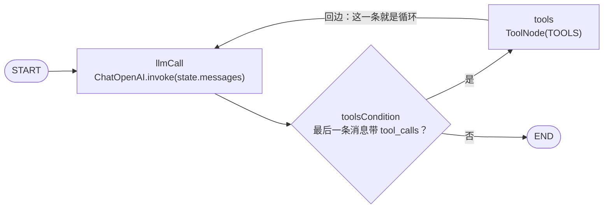
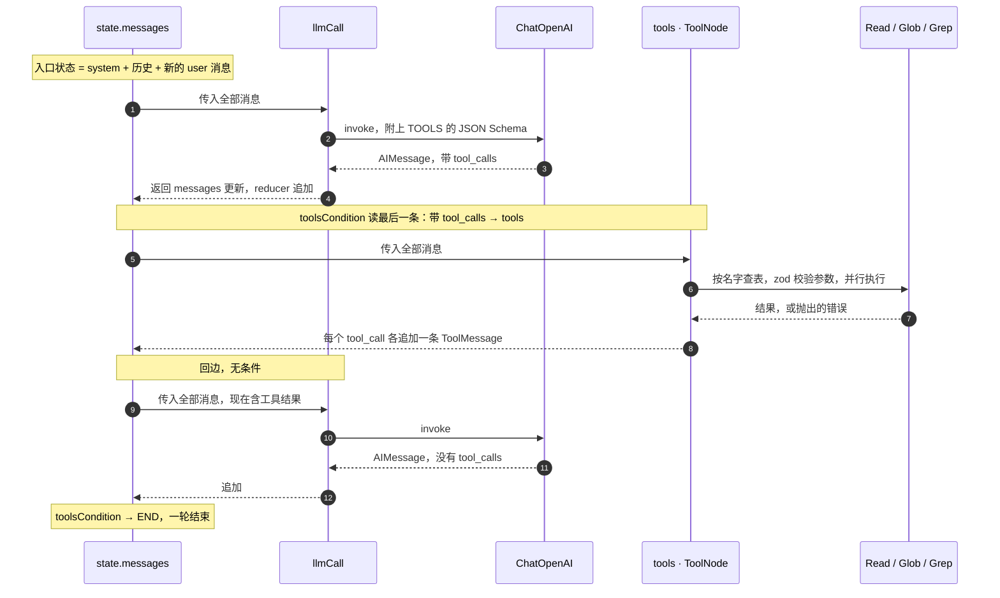

# mimicc-ai

用于 agent 开发的 TypeScript 脚手架。**Bun 独占**——包管理与运行时都是它，ESM + 严格模式
TypeScript。

## 快速开始

```bash
bun install
cp .env.example .env   # 按需填写
bun run dev
```

## 脚本

全部由 Bun 触发并执行。

| 命令                              | 作用                                                   |
| --------------------------------- | ------------------------------------------------------ |
| `bun run dev`                     | 监听模式运行 `src/main.ts`，改动即重启                 |
| `bun run chat`                    | 同上但不监听——改文件不会打断正在进行的对话             |
| `bun run build`                   | 清空 `dist/` 后用 `bun build` 打包成单文件 + sourcemap |
| `bun run start`                   | 运行构建产物 `dist/main.js`（需先 `bun run build`）    |
| `bun run clean`                   | 删除 `dist/`（跨平台，不依赖 `rm`）                    |
| `bun run typecheck`               | `tsc --noEmit`，只做类型检查                           |
| `bun run test`                    | Bun 内置测试运行器                                     |
| `bun run test:watch`              | 测试监听模式                                           |
| `bun run test:coverage`           | 覆盖率，低于门槛非零退出                               |
| `bun run lint` / `lint:fix`       | ESLint（开启了类型感知规则）                           |
| `bun run format` / `format:check` | Prettier                                               |
| `bun run check`                   | typecheck + lint + format:check + test，CI 跑的就是它  |

部署路径是 `bun run build` → `bun run start`。`dev` 跑源码，生产跑 `dist/main.js`，两者不混用。

## 目录与文件

```
.github/workflows/ci.yml   CI：push 到 main 和所有 PR 触发
.husky/pre-commit          目前是 no-op，见「提交前检查」
src/
  index.ts     公开导出（无副作用的 barrel）
  main.ts      可执行入口
  config.ts    环境变量 schema 与校验（zod）
  logger.ts    结构化日志，JSON 单行写 stderr
  prompt.ts    系统提示词：静态段 + 环境段
  agent.ts     **核心循环**：LangGraph StateGraph + ToolNode + 回边
  repl.ts      交互式控制台：消费图的双模式流、渲染、中断处理
  tools/
    readonly.ts  Read / Glob / Grep（LangChain tool，zod schema + 安全护栏）
    index.ts     注册表
tests/
  config.test.ts
  agent.test.ts
learn/                     教学工作区（讲义 / 参考卡 / 学习记录）
                           已在 .prettierignore 与 eslint.config.js 里排除
```

| 文件                                   | 作用                                             |
| -------------------------------------- | ------------------------------------------------ |
| `package.json`                         | 依赖、脚本、`engines`                            |
| `bun.lock`                             | 依赖锁文件，**要提交**                           |
| `tsconfig.json`                        | 仅用于类型检查（`noEmit`），打包交给 `bun build` |
| `bunfig.toml`                          | Bun 配置，目前用于覆盖率门槛                     |
| `eslint.config.js`                     | ESLint 扁平配置，开启类型感知规则                |
| `.prettierrc.json` / `.prettierignore` | 代码格式规则与排除项                             |
| `.editorconfig`                        | 编辑器级基础约定，跨 IDE 生效                    |
| `.bun-version`                         | Bun 版本的单一事实来源，CI 从它读                |
| `.env.example`                         | 环境变量模板兼文档；真实 `.env` 不进版本库       |

## 版本固定

两样东西各自锁在一处，CI 和本地读的是同一份：

| 对象 | 锁在哪         | 是否强制                  |
| ---- | -------------- | ------------------------- |
| Bun  | `.bun-version` | CI 读取；本地靠约定       |
| 依赖 | `bun.lock`     | CI 用 `--frozen-lockfile` |

`package.json` 的 `engines.bun` 只声明下限，**装依赖时不校验**——Bun 没有 pnpm `engineStrict`
的等价物。版本一致性实际靠 `.bun-version` 加 CI 里读它那一步保证。

## 约定

- **Bun 独占**：装依赖、跑脚本、执行代码全是它，锁文件只有 `bun.lock`。不要用
  `npm install` / `pnpm install`，会产生与之漂移的第二份锁文件（`.gitignore` 已挡掉
  `pnpm-lock.yaml`）。
- **类型检查不在运行时发生**：Bun 直接剥离类型执行，不校验。类型错误只有
  `bun run typecheck` 会报，所以它必须留在 CI 里——这是 CI 存在的首要理由。
- **环境变量**：统一在 `src/config.ts` 的 schema 里声明，代码读 `loadConfig()` 的返回值，
  不直接摸 `process.env`。缺失或非法的变量会在启动时一次性报错。
- **`.env` 由 Bun 自动加载**，不需要任何 flag，也没有 dotenv 依赖。
- **导入不写扩展名**（`import { loadConfig } from "./config"`）——`moduleResolution: bundler`
  加 Bun 的解析器都支持，不必像 Node ESM 那样写 `.js`。
- **跨目录导入用 `@/` 别名**（`@/*` → `src/*`），同目录的兄弟模块用相对路径。别名避免了
  目录变深后出现 `../../../`。tsc、`bun test`、`bun build` 三处解析一致，只在
  `tsconfig.json` 的 `paths` 里配置一次（`@/*` → `./src/*`）。
- **日志走 stderr**，stdout 留给程序正常输出，方便管道。
- **类型严格度**：开启了 `noUncheckedIndexedAccess`、`exactOptionalPropertyTypes` 等额外
  检查。如果某处确实过严，在该文件局部放宽，而不是全局关掉。

## 提交前检查

> **当前状态：没有生效的提交前检查。** `.husky/pre-commit` 是一个 no-op。
> 原计划是对暂存文件跑 lint-staged，但 `lint-staged` 既没进 `devDependencies` 也没有任何
> 配置，`package.json` 里也没有 `prepare` 脚本去装 husky 钩子。保持 no-op 是为了不让第一次
> `git commit` 被一个跑不起来的钩子拦下。

要启用，三步：

1. `bun add -d lint-staged husky`
2. `package.json` 加 `"prepare": "husky"`（让 `bun install` 自动装钩子），并加 lint-staged
   配置：`*.{ts,js}` 跑 `eslint --fix` 再 `prettier --write`；`*.{json,md,yml,yaml}` 只跑
   `prettier --write`
3. 取消 `.husky/pre-commit` 里 `bunx lint-staged` 那行的注释

**typecheck 和测试不该进钩子**——它们需要全量跑，会让每次提交都变慢，交给 CI 更合适。
绕过钩子用 `git commit --no-verify`，但 CI 仍会拦。

## 覆盖率

门槛在 `bunfig.toml`，当前 `0.8`，`bun run test:coverage` 低于门槛会非零退出，CI 会挂。

有一个 Bun 的局限要知道：**它只统计被测试实际加载过的文件**。完全没有人 import 的模块
不会出现在报告里，也不会拉低这个数字。所以它衡量的是"已测代码的质量"，不是"测了多少"。
不要拿它当测试完备性的证据。

## 已知约束

- `typescript` 锁在 5.x。TypeScript 7（原生移植版）会让 `typescript-eslint` 直接报
  `does not support TS 7.0` 并拒绝运行，等它跟进后再升。
- **机器上不需要 Node。** ESLint、Prettier、tsc 都是 Node CLI，但 Bun 能直接执行它们——
  `bun --bun run typecheck / lint / format:check` 三项本机实测通过，CI 也不再安装 Node。
- `engines.bun` 只是声明，装依赖时不强制校验（见「版本固定」）。
- **`@langchain/openai` 自带一份 `openai@6.49.0`**。跨副本的类身份不同，所以**不要用
  `instanceof OpenAI.APIError` 判别错误**——会全部落到兜底分支。按 `status` 判别。

## LLM 接入

模型层是 `@langchain/openai` 的 `ChatOpenAI`，走 **OpenAI 兼容协议**——协议兼容不代表用的是
OpenAI 的模型。选哪个 provider、哪个模型，由 `src/models.ts` 的注册表决定，每个 provider 自带
baseURL、默认模型、API key 变量，每个模型自带窗口上限和 maxTokens 这两个**实测/文档事实**。

| 变量                      | 必填           | 默认值                 | 说明                                     |
| ------------------------- | -------------- | ---------------------- | ---------------------------------------- |
| `LLM_PROVIDER`            | 否             | `deepseek`             | `deepseek` 或 `moonshot-cn`              |
| `LLM_DEEPSEEK_API_KEY`    | 选 DeepSeek 时 | 无                     | DeepSeek key；`LLM_API_KEY` 是其弃用别名 |
| `LLM_MOONSHOT_CN_API_KEY` | 选 Moonshot 时 | 无                     | Moonshot 中国区 key                      |
| `LLM_MODEL`               | 否             | 该 provider 的默认模型 | 必须是注册过的模型，未知即启动报错       |
| `LLM_BASE_URL`            | 否             | provider 注册表里的值  | 代理 / 自建端点的逃生门                  |

DeepSeek 默认模型 `deepseek-v4-flash`；Moonshot 中国区默认 `kimi-k3`，另有 `kimi-k2.7-code`、
`kimi-k2.6`（`https://api.moonshot.cn/v1`，`/v1` 必带，与中国区 `.cn` / 国际区 `.ai` 是两套
平台两套 key）。

`LLM_MODEL` 必须是注册表里写明的模型：窗口上限是溢出保护靠它算的，而对一个没核实过窗口的别名
猜一个数，正是这里拒绝的事。

## 控制台

`bun run chat`（或 `bun run dev`）进入 REPL：

| 操作     | 行为                                                              |
| -------- | ----------------------------------------------------------------- |
| 回车     | 发送，回复流式打印；reasoning 用暗色，正文用常色                  |
| 工具调用 | 每次调用打一行暗色 `· Read {...} → 36 lines`                      |
| Bash     | 停下来问：`[a] approve  [e] edit  [r] reject`，别的文字即拒绝理由 |
| `/clear` | **开一个新线程**（旧线程仍留在 checkpointer 里，没有被删）        |
| `/exit`  | 退出，等同 Ctrl+D                                                 |
| `Ctrl+C` | 回复进行中则中断本次回复；空闲时按下则退出                        |

**被 Ctrl+C 打断的回复不会进入历史。**状态只在**节点边界**提交，所以一个还没跑完的
`llmCall` 节点，它已经流出来的正文只存在于终端上，不在状态里。实测（中止 / 不中止对照）：
在第 15 个 chunk 处中止 → 抛 `AbortError`，最后的状态快照仍是 `system → human`；不中止跑完
→ `system → human → ai`。

这与手写版**不同**：那一版会把已生成的部分留进历史，理由是「它仍然是有效上下文」。要恢复
这个行为，需要 REPL 自己把流过的正文攒起来、在中止时补一条 assistant 消息（约十行）。
目前没做。

**历史现在归 checkpointer 管**（`MemorySaver`，进程内），REPL 每轮只发新消息、只保留一个
「已渲染到第几条」的水位线。系统提示词是线程的第 0 条，每个线程只发一次。`/clear` 不删任何
东西，只是换一个 `thread_id`——旧线程仍可寻址，时间旅行的前提就是这个。进程退出则全部消失；
要落盘是换一个 saver，不是换一套设计。

**已知回退：一轮失败会留下一条没被回答的用户消息。**手写版会把它回滚掉（理由是「别在历史里
留下一个模型从未回答过的提问」），现在不会——那条消息已经被 checkpointer 提交了。实测：一轮
500 之后线程是 `system → human`，下一轮变成 `system → human → human → ai`。协议上合法，只是
不干净。要恢复需要 REPL 在出错时用 `updateState` + `RemoveMessage` 把它摘掉，约十行。目前没做。

渲染怎么做的（纯 REPL 实现细节，与循环无关）：`runTurn` 用
`streamMode: ["messages", "values"]` 同时消费两路。`messages` 是 token 级 chunk，正文与
reasoning 边写边出；`values` 是每个节点后的完整状态，工具活动从它的增量里渲染——**chunk 管
散文，state 管结构**，两条通道不重叠。

`values` 还是确认门唯一的出口：中断到来时是一个**只带 `__interrupt__`、没有 `messages` 键**的
values 事件。不加判断地读 `state.messages` 会直接崩，这不是缺功能。

确认的那一行不用 `rl.question` 读——它和 `for await (const line of rl)` 抢同一批 `line` 事件，
谁先拿到取决于时序。改成状态机：下一行就是决策，管道和 TTY 行为一致。

日志走 stderr，所以 `LOG_LEVEL=warn` 能得到干净的对话记录，`bun run chat 2>/dev/null` 也行。

## 核心循环

循环建在 **LangGraph** 上（`src/agents/loop.ts`）。整个文件里**没有 `while`**：



- `llmCall` 节点调 `ChatOpenAI`（`baseURL` 指向 DeepSeek）
- `tools` 节点是 `ToolNode`。**这个名字是承重的**——`toolsCondition` 源码里硬编码了字符串
  `"tools"`，改名会静默断掉路由
- `toolsCondition` 读最后一条消息：带 `tool_calls` 就去 `tools`，否则 `END`。它是纯函数，
  终止逻辑因此可以脱离请求单独推理
- `RECURSION_LIMIT = 24` 数的是**节点执行次数**，一圈两个节点，所以约 12 次模型调用。
  它是防跑飞的兜底，不是策略——识别"模型在原地打转"并体面收场是另一件事，没做

### 一圈循环的内部次序



三处值得单独记住：

- **节点不改状态，节点返回更新。** `llmCall` 返回的是 `{ messages: [reply] }` 而不是一份新
  历史，怎么并进去由 `MessagesValue` 的 reducer 决定——它按 id 匹配，新消息追加、同 id 原地
  更新。所以看一个节点返回什么，**推不出**状态会怎么变，必须回去看 schema。
- **状态只在节点边界提交。** 一个还没跑完的 `llmCall` 对状态毫无贡献，哪怕它已经流出了大半
  段正文。这是崩溃可续跑的前提，也是 Ctrl+C 打断后那段回复不进历史的原因。
- **每个 `tool_call` 都会被回答。** `ToolNode` 对失败也回一条消息，所以状态里不会留下悬空的
  调用——provider 会拒绝那样的历史。实测一轮两个调用其中一个失败时，两条结果都在。

六个工具，和系统提示词里描述的是同一份清单——`tests/tools/readonly.test.ts` 钉着这条对应关系：

| 工具    | 作用                                                                               |
| ------- | ---------------------------------------------------------------------------------- |
| `Read`  | 读工作目录内的 UTF-8 文本文件，带 1 起的行号，上限 64 KB                           |
| `Write` | 新建或整体覆盖文件，自动建父目录。覆盖时在回执里写明「overwrote N bytes -> M」     |
| `Edit`  | 串替换，四级模糊匹配吸收模型的格式误差。**目标必须唯一**——命中 2 处以上一律报错    |
| `Bash`  | 跑一条 shell 命令，超时 120 秒。非零退出码作为结果返回（`[exit N]`），不是工具失败 |
| `Glob`  | 按路径模式找文件，跳过 node_modules / .git / dist / coverage                       |
| `Grep`  | 按内容找，返回 `path:line:text`，上限 100 条                                       |

### Edit 的四级匹配：容错放在工具里

模型手上从来没有文件字节，只有 `Read` 的**渲染**——每行前面是我们加的 `N\t`，而等宽终端把
tab、四个空格、行尾空格显示成同一种「什么都没有」。所以 `oldString` 是一次**重建**，误差方向
可预测：换行符、块首尾的空行、缩进宽度、tab 与空格。

与其要求模型逐字节复现，不如把容错做进工具（`src/tools/matching.ts`）：

| 级  | 放宽了什么               | 治的是哪种幻觉                            |
| --- | ------------------------ | ----------------------------------------- |
| 1   | 无，精确子串             | ——（最快；行内改符号名也只有这一级能做）  |
| 2   | 按行比较，忽略行尾符差异 | CRLF 文件配 LF 的 `oldString`             |
| 3   | 去掉块首尾的空行         | 模型给代码块前后多垫了空行                |
| 4   | 逐行 `trim()` 后比较     | **缩进差异**——tab 写成空格、2 格写成 4 格 |

**唯一性是整条梯子的安全底线。** 任何一级命中 2 处以上立即报错、要求补更多上下文行，
**绝不在候选里挑一个**。歧义发生时也不再往更松的级别退——更松只会命中更多，往下走严格更坏。

两处容易写错、已用测试钉住：

- **不能「归一化整个文件再写回」**。那样一次编辑会把整份文件的 CRLF 悄悄换成 LF。实现按行
  切分、保留每行自己的行尾符，只替换命中的那几行。
- **第 4 级必须重缩进**。既然是忽略缩进匹配上的，就不能把模型的缩进原样写回去，否则文件会
  半 tab 半空格。`newString` 会被移回文件真实的缩进基线，空行不会因此获得尾随空格。

回执写明**用的是哪一级**（`edited x.ts at line 3 (indentation ignored)`）。这不是装饰：提示词
告诉模型「Edit 成功就意味着改动落地了，别复读」，只有当工具老实交代它退到了第几级，那句话
才继续成立。

还有两处「不这么写就会静默出错」的收尾，同样有测试：

- **删除时（`newString` 为空）连行尾符一起去掉**，否则「删掉这几行」会变成「把这几行清空」，
  留下的空行在终端里根本看不见。但精确匹配那一级不这么做——删掉一行里的一小段，不该顺手
  吃掉那一行的换行。
- **重叠出现也算数**：`aa` 在 `aaa` 里是两处不是一处。用 `split().length - 1` 会报一处并静默
  替掉第一个，那正是唯一性要禁止的「替调用方挑一个」。多数出来的只会是拒绝，不会是错改。

**一类没覆盖**：`oldString` 里带着 `Read` 加的 `2\t` 前缀。数字不是空白，`trim()` 够不着。
这一级没做——错误信息里直接点名了这个前缀，让模型自己改。

### 并发：引擎无脑并行，工具自己负责互斥

一批工具调用是**并行**跑的，实测：三个各睡 300ms 的工具同毫秒起跑、总耗时 329ms；结果按
`tool_calls` 原序返回；单个工具抛错被转成 tool 消息，不影响同批其他工具。这是 Fork-Join，
而那个 join **不是设计选择**——带 `tool_calls` 的 assistant 轮必须每个 call 都有结果，
否则下一次请求非法。

调度层刻意不做依赖分析：**模型在一轮里发出多个调用，就假设它们互不依赖。** 这条假设是对的,
模型知道自己的意图，有强先后依赖的操作它会分两轮做。

但「独立」有两种，而模型只判断得了第一种：

|            | 模型意义上的独立        | 引擎意义上的可并行     |
| ---------- | ----------------------- | ---------------------- |
| 判据       | B 的入参不依赖 A 的结果 | 两者不写同一份可变资源 |
| 谁判断得了 | 模型                    | **只有工具自己**       |

实测过的反例：让模型改一个配置文件的两个字段，它在同一轮发出两个 `Edit`——**完全正确**,
两者之间确实没有数据依赖。但 `Edit` 是 read-modify-write，两个并发实例各读原文、各改、各写,
后写的覆盖先写的。当时两个工具**都报告了成功**，而提示词又说「Edit 成功就意味着改动落地了,
别复读」。

所以互斥放在工具里，不放在调度器里：`src/tools/workspace.ts` 的 `withPathLock`,
键是解析后的绝对路径。

- `Read` / `Write` / `Edit` 持锁，`Edit` 覆盖整个 read-modify-write（只锁写的那一刻等于没锁）
- **按路径而不是全局写锁**：全局锁等于用「假设一切都可能冲突」去回答模型的独立性判断,
  改 5 个不同文件也会排队。不同路径仍然并行
- `Glob` / `Grep` **不进锁**：批量扫描，逐文件加锁要花真实时间，换来的最多是搜索结果里少一行脏数据
- `Bash` 也**不串行化**：它碰什么无法从参数看出来，路径锁管不着；而在 Bash 这一处偷偷不信任
  模型，会让整套策略难以推理。要不信任就该整体不信任

### 确认门：只有 Bash 会问

写入侧的三个工具，防护方式**按能不能被代码框住来分**：

- `Write` / `Edit` 走 `resolveInside`（`src/tools/workspace.ts`）——出不了工作目录、碰不到
  `.env*` / `id_*` / `*.pem` / `*.key`。危害面由代码定死，所以不问。
- `Bash` 框不住。它能 curl 外传、能 rm、能改 git 历史，而「这条命令安不安全」是个解析军备
  竞赛（`foo && rm -rf` 怎么算）。**所以一律问**，不写命令分类器。

实现是 `humanInTheLoopMiddleware`（`langchain`），策略表在 `src/agents/loop.ts` 的
`CONFIRMATION_POLICY`。**中间件对没列进表的工具是自动放行**（fail-open），所以六个工具全部
显式列出，并且有测试断言「注册表和策略表逐项对应」——新加一个工具而不表态，测试会挂。

控制台里长这样，三选一或直接打理由：

```
⚠ Bash wants to run:
    rm -rf build
  [a] approve   [e] edit   [r] reject (any other text becomes the reason)
> 这台机器上别删东西
```

拒绝理由会作为工具结果回灌给模型，所以「别在生产上跑」比一个干巴巴的拒绝有用得多。

**调度不用自己写。** `ToolNode` 按名字查表、用 zod schema 校验参数、并行执行、并把每一种
失败（工具不存在 / 参数不符 / 工具自己抛异常）都变成一条 tool 消息。这一点很要紧：provider
要求每个 `tool_call` 都必须被回答，缺一条整个历史就非法——实测一轮两个调用其中一个失败时，
配对仍然保住。这些是框架实打实替掉的手写代码。

**只读不等于零风险**：工具输出会被发给模型，所以路径不受限就等于一条外泄通道。`Read` 和
`Grep` 因此把路径限定在工作目录内，并拒读 `.env*` / `id_*` / `*.pem` / `*.key` / `.git/`
这类文件。想放开就改 `src/tools/readonly.ts` 里的 `SECRET`。

### 控制台跑的是哪一条

**`createUniversalAgent`**（`langchain` 的 `createAgent`）。`src/main.ts` 只构造它一个。

`createAgent` 内部就是 `new ReactAgent(...)`，它建的也是 model 节点 + tools 节点 + 一条回边
——**循环不是它带来的东西**。它带来的是四个 middleware 插槽（beforeAgent / beforeModel /
afterModel / afterAgent）外加 `wrapModelCall` / `wrapToolCall`，以及它们之间的路由。确认门、
打转计数器、历史摘要该挂的地方在那里，上面那张图里没有位置放。

### 那上面那张图还留着干嘛

`createAgentGraph` **不再被任何运行代码调用**，但它没被删，理由写在
`src/agents/loop.ts` 的注释里，一句话版本：**它是这个仓库要产出的东西本身**（把核心循环建在
LangGraph 上并弄懂它），同时是对照组。

`tests/agent.test.ts` 用 `describe.each` 把两条循环跑同一组断言：同样的消息序列、同样的工具
清单、同样的 `tool_call` 配对。控制台的双路 stream 两边也一致（各 4 个 `values`、7 个
`messages` 事件）。这组测试是唯一能让「middleware 那层到底值什么」被量出来而不是被争论的东西，
也是防止这段参考实现悄悄烂掉的唯一探针。

**不要往 `createAgentGraph` 上加 middleware 插槽。** 那等于把 `node_modules` 里已有的约 760
行重写一遍，落点还是 `createUniversalAgent`。需要它没有的能力时，换构造函数，不是扩展它。

注意 `AgentGraph` 是**显式声明**的接口，不是 `ReturnType<typeof createAgentGraph>`——两边编译出
的图类型确实不同（langchain 那边带它自己的内建 state），从任一边派生都会让它成为另一边必须
模仿的标准，编译器直接拒绝。

## DeepSeek 的行为

传输、分片拼装、错误映射现在都在 `ChatOpenAI` 里，不再是本仓库的代码。但下面这些 DeepSeek
与 OpenAI 的差异仍然会影响你，**全部为 2026-08-12 对 deepseek-v4-flash / -pro 的实测**：

- DeepSeek 会多返回 `reasoning_content`，该字段不在 OpenAI 协议里。**v4 默认就返回它**，
  不是推理模型专属。`ChatOpenAI` 把它放进 `additional_kwargs.reasoning_content`，流式 chunk
  上也有——REPL 的暗色思考就是从那里读的。要关掉用 `thinking: { type: "disabled" }`，但实测
  关掉后总 token 反而更多（模型不思考时正文写得更长），别当省钱手段用。
- **`reasoning` 的回传约束反转了，但比看上去窄得多。**旧规则是「必须丢掉，否则 400」。
  v4 实测（2026-08-12）：只有当 assistant 轮带 `tool_calls`、**且那个 tool_call id 不是
  DeepSeek 自己签发过的**，才要求回传 `reasoning_content`（报错原文 “The
  \`reasoning_content\` in the thinking mode must be passed back to the API.”）。
  DeepSeek 签发过的 id——**哪怕来自另一段对话**——不带也是 200；格式相符但从未签发的假 id
  会 400。流式与否无差别；`thinking: { type: "disabled" }` 下一律通过。
- 所以**正常 agent 循环不会撞上它**，id 都来自模型。框架的 converter 发出去时**会丢掉**
  `reasoning_content`，DeepSeek 对自签发的 id 仍返回 200——但 `src/agents/model.ts` 现在把它
  原样回传，对 DeepSeek 无害、且把「非自签发 id 才报错」那个窄例也堵上了（Moonshot 无条件要求
  回传，这一步是它跑得起来的必要条件）。
- **`tool_choice: "required"` 不被支持**：400 `Thinking mode does not support this tool_choice`。
  想强制调工具得靠提示词，或先关 thinking。
- **v4 两个模型都支持 `tools`**（实测）。`temperature` / `top_p` 在 v4 上未实测；旧的
  `deepseek-reasoner` 三者都不支持，适配器只在字段存在时才发送，这个防御保留着。
- 余额不足是 **402**，OpenAI 用 429——这是唯一的状态码语义差异。`src/console/repl.ts` 的
  `describe()` 按 `status` 给提示，因为跨包的 `instanceof` 判别不可靠（见「已知约束」）。
- `usage` 里除 OpenAI 标准字段（`prompt_tokens_details.cached_tokens`、
  `completion_tokens_details.reasoning_tokens`）外，还叠加了私有的
  `prompt_cache_hit_tokens` / `prompt_cache_miss_tokens`。**多出来的字段不影响协议兼容性**
  ——客户端只读自己认识的键，这也是「除 reasoning 之外都兼容」这个判断成立的原因。LangChain
  把缓存数规范化成 `usage_metadata.input_token_details.cache_read`。

## 依赖说明

| 依赖                   | 用途                                                       |
| ---------------------- | ---------------------------------------------------------- |
| `@langchain/langgraph` | 核心循环的图运行时；`ToolNode` / `toolsCondition` 也来自它 |
| `@langchain/openai`    | `ChatOpenAI`，模型层兼传输层                               |
| `@langchain/core`      | 消息类型、`tool()`；被上面两个依赖                         |
| `zod`                  | 环境变量校验、工具参数 schema、LangGraph state schema      |
