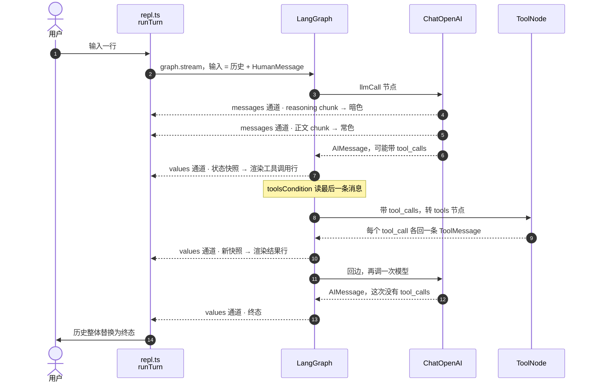

# mimicc-ai

用于 agent 开发的 TypeScript 脚手架。**Bun 独占**——包管理与运行时都是它，ESM + 严格模式
TypeScript。

## 快速开始

```bash
bun install
cp .env.example .env   # 按需填写
bun run dev
```

## 脚本

全部由 Bun 触发并执行。

| 命令                              | 作用                                                   |
| --------------------------------- | ------------------------------------------------------ |
| `bun run dev`                     | 监听模式运行 `src/main.ts`，改动即重启                 |
| `bun run chat`                    | 同上但不监听——改文件不会打断正在进行的对话             |
| `bun run build`                   | 清空 `dist/` 后用 `bun build` 打包成单文件 + sourcemap |
| `bun run start`                   | 运行构建产物 `dist/main.js`（需先 `bun run build`）    |
| `bun run clean`                   | 删除 `dist/`（跨平台，不依赖 `rm`）                    |
| `bun run typecheck`               | `tsc --noEmit`，只做类型检查                           |
| `bun run test`                    | Bun 内置测试运行器                                     |
| `bun run test:watch`              | 测试监听模式                                           |
| `bun run test:coverage`           | 覆盖率，低于门槛非零退出                               |
| `bun run lint` / `lint:fix`       | ESLint（开启了类型感知规则）                           |
| `bun run format` / `format:check` | Prettier                                               |
| `bun run check`                   | typecheck + lint + format:check + test，CI 跑的就是它  |

部署路径是 `bun run build` → `bun run start`。`dev` 跑源码，生产跑 `dist/main.js`，两者不混用。

## 目录与文件

```
.github/workflows/ci.yml   CI：push 到 main 和所有 PR 触发
.husky/pre-commit          目前是 no-op，见「提交前检查」
src/
  index.ts     公开导出（无副作用的 barrel）
  main.ts      可执行入口
  config.ts    环境变量 schema 与校验（zod）
  logger.ts    结构化日志，JSON 单行写 stderr
  prompt.ts    系统提示词：静态段 + 环境段
  agent.ts     **核心循环**：LangGraph StateGraph + ToolNode + 回边
  repl.ts      交互式控制台：消费图的双模式流、渲染、中断处理
  tools/
    readonly.ts  Read / Glob / Grep（LangChain tool，zod schema + 安全护栏）
    index.ts     注册表
tests/
  config.test.ts
  agent.test.ts
learn/                     教学工作区（讲义 / 参考卡 / 学习记录）
                           已在 .prettierignore 与 eslint.config.js 里排除
```

| 文件                                   | 作用                                             |
| -------------------------------------- | ------------------------------------------------ |
| `package.json`                         | 依赖、脚本、`engines`                            |
| `bun.lock`                             | 依赖锁文件，**要提交**                           |
| `tsconfig.json`                        | 仅用于类型检查（`noEmit`），打包交给 `bun build` |
| `bunfig.toml`                          | Bun 配置，目前用于覆盖率门槛                     |
| `eslint.config.js`                     | ESLint 扁平配置，开启类型感知规则                |
| `.prettierrc.json` / `.prettierignore` | 代码格式规则与排除项                             |
| `.editorconfig`                        | 编辑器级基础约定，跨 IDE 生效                    |
| `.bun-version`                         | Bun 版本的单一事实来源，CI 从它读                |
| `.env.example`                         | 环境变量模板兼文档；真实 `.env` 不进版本库       |

## 版本固定

两样东西各自锁在一处，CI 和本地读的是同一份：

| 对象 | 锁在哪         | 是否强制                  |
| ---- | -------------- | ------------------------- |
| Bun  | `.bun-version` | CI 读取；本地靠约定       |
| 依赖 | `bun.lock`     | CI 用 `--frozen-lockfile` |

`package.json` 的 `engines.bun` 只声明下限，**装依赖时不校验**——Bun 没有 pnpm `engineStrict`
的等价物。版本一致性实际靠 `.bun-version` 加 CI 里读它那一步保证。

## 约定

- **Bun 独占**：装依赖、跑脚本、执行代码全是它，锁文件只有 `bun.lock`。不要用
  `npm install` / `pnpm install`，会产生与之漂移的第二份锁文件（`.gitignore` 已挡掉
  `pnpm-lock.yaml`）。
- **类型检查不在运行时发生**：Bun 直接剥离类型执行，不校验。类型错误只有
  `bun run typecheck` 会报，所以它必须留在 CI 里——这是 CI 存在的首要理由。
- **环境变量**：统一在 `src/config.ts` 的 schema 里声明，代码读 `loadConfig()` 的返回值，
  不直接摸 `process.env`。缺失或非法的变量会在启动时一次性报错。
- **`.env` 由 Bun 自动加载**，不需要任何 flag，也没有 dotenv 依赖。
- **导入不写扩展名**（`import { loadConfig } from "./config"`）——`moduleResolution: bundler`
  加 Bun 的解析器都支持，不必像 Node ESM 那样写 `.js`。
- **跨目录导入用 `@/` 别名**（`@/*` → `src/*`），同目录的兄弟模块用相对路径。别名避免了
  目录变深后出现 `../../../`。tsc、`bun test`、`bun build` 三处解析一致，只在
  `tsconfig.json` 的 `paths` 里配置一次（`@/*` → `./src/*`）。
- **日志走 stderr**，stdout 留给程序正常输出，方便管道。
- **类型严格度**：开启了 `noUncheckedIndexedAccess`、`exactOptionalPropertyTypes` 等额外
  检查。如果某处确实过严，在该文件局部放宽，而不是全局关掉。

## 提交前检查

> **当前状态：没有生效的提交前检查。** `.husky/pre-commit` 是一个 no-op。
> 原计划是对暂存文件跑 lint-staged，但 `lint-staged` 既没进 `devDependencies` 也没有任何
> 配置，`package.json` 里也没有 `prepare` 脚本去装 husky 钩子。保持 no-op 是为了不让第一次
> `git commit` 被一个跑不起来的钩子拦下。

要启用，三步：

1. `bun add -d lint-staged husky`
2. `package.json` 加 `"prepare": "husky"`（让 `bun install` 自动装钩子），并加 lint-staged
   配置：`*.{ts,js}` 跑 `eslint --fix` 再 `prettier --write`；`*.{json,md,yml,yaml}` 只跑
   `prettier --write`
3. 取消 `.husky/pre-commit` 里 `bunx lint-staged` 那行的注释

**typecheck 和测试不该进钩子**——它们需要全量跑，会让每次提交都变慢，交给 CI 更合适。
绕过钩子用 `git commit --no-verify`，但 CI 仍会拦。

## 覆盖率

门槛在 `bunfig.toml`，当前 `0.8`，`bun run test:coverage` 低于门槛会非零退出，CI 会挂。

有一个 Bun 的局限要知道：**它只统计被测试实际加载过的文件**。完全没有人 import 的模块
不会出现在报告里，也不会拉低这个数字。所以它衡量的是"已测代码的质量"，不是"测了多少"。
不要拿它当测试完备性的证据。

## 已知约束

- `typescript` 锁在 5.x。TypeScript 7（原生移植版）会让 `typescript-eslint` 直接报
  `does not support TS 7.0` 并拒绝运行，等它跟进后再升。
- **机器上不需要 Node。** ESLint、Prettier、tsc 都是 Node CLI，但 Bun 能直接执行它们——
  `bun --bun run typecheck / lint / format:check` 三项本机实测通过，CI 也不再安装 Node。
- `engines.bun` 只是声明，装依赖时不强制校验（见「版本固定」）。
- **`@langchain/openai` 自带一份 `openai@6.49.0`**。跨副本的类身份不同，所以**不要用
  `instanceof OpenAI.APIError` 判别错误**——会全部落到兜底分支。按 `status` 判别。

## LLM 接入

模型层是 `@langchain/openai` 的 `ChatOpenAI`，走 **OpenAI 兼容协议**，但 `baseURL` 指向
DeepSeek——协议兼容不代表用的是 OpenAI 的模型。三个环境变量控制它：

| 变量           | 必填 | 默认值                     |
| -------------- | ---- | -------------------------- |
| `LLM_API_KEY`  | 是   | 无，缺失则启动即失败       |
| `LLM_BASE_URL` | 否   | `https://api.deepseek.com` |
| `LLM_MODEL`    | 否   | `deepseek-chat`            |

`GET /models` 目前只列 `deepseek-v4-flash` 与 `deepseek-v4-pro`；`deepseek-chat` 和
`deepseek-reasoner` 虽未列出但仍可调用（别名，实测 2026-08-12）。所以上面那个默认值指向一个
不在清单里的别名，落到哪个 v4 未知——要确定性就显式设 `LLM_MODEL=deepseek-v4-flash`。

## 控制台

`bun run chat`（或 `bun run dev`）进入 REPL：

| 操作     | 行为                                             |
| -------- | ------------------------------------------------ |
| 回车     | 发送，回复流式打印；reasoning 用暗色，正文用常色 |
| 工具调用 | 每次调用打一行暗色 `· Read {...} → 36 lines`     |
| `/clear` | 清空对话历史                                     |
| `/exit`  | 退出，等同 Ctrl+D                                |
| `Ctrl+C` | 回复进行中则中断本次回复；空闲时按下则退出       |

**被 Ctrl+C 打断的回复不会进入历史。**状态只在**节点边界**提交，所以一个还没跑完的
`llmCall` 节点，它已经流出来的正文只存在于终端上，不在状态里。实测（中止 / 不中止对照）：
在第 15 个 chunk 处中止 → 抛 `AbortError`，最后的状态快照仍是 `system → human`；不中止跑完
→ `system → human → ai`。

这与手写版**不同**：那一版会把已生成的部分留进历史，理由是「它仍然是有效上下文」。要恢复
这个行为，需要 REPL 自己把流过的正文攒起来、在中止时补一条 assistant 消息（约十行）。
目前没做。

某一轮完全没有产出时，那条用户消息会被回滚掉，避免历史里留下一个模型从未回答过的提问。

日志走 stderr，所以 `LOG_LEVEL=warn` 能得到干净的对话记录，`bun run chat 2>/dev/null` 也行。

## 核心循环

循环建在 **LangGraph** 上（`src/agent.ts`）。整个文件里**没有 `while`**：


- `llmCall` 节点调 `ChatOpenAI`（`baseURL` 指向 DeepSeek）
- `tools` 节点是 `ToolNode`。**这个名字是承重的**——`toolsCondition` 源码里硬编码了字符串
  `"tools"`，改名会静默断掉路由
- `toolsCondition` 读最后一条消息：带 `tool_calls` 就去 `tools`，否则 `END`。它是纯函数，
  终止逻辑因此可以脱离请求单独推理
- `RECURSION_LIMIT = 24` 数的是**节点执行次数**，一圈两个节点，所以约 12 次模型调用。
  它是防跑飞的兜底，不是策略——识别"模型在原地打转"并体面收场是另一件事，没做

### 一次用户输入，端到端

REPL 用 `streamMode: ["messages", "values"]` 同时消费两路。**chunk 管散文，state 管结构。**



三处值得单独记住：

- **`values` 只在节点边界到达。** 所以一个还没跑完的 `llmCall`，它已经流出去的正文只在终端上、
  不在状态里——这就是 Ctrl+C 打断后那段回复不进历史的原因（见「控制台」）。
- **工具消息不从 chunk 通道渲染。** `runTurn` 里显式 `if (chunk.getType() === "tool") continue`，
  工具活动一律从状态快照的增量里渲染。两条通道各管一件事，不重叠。
- **历史是整体替换，不是追加。** REPL 拿最后一次 `values` 快照直接替掉本地数组，所以
  reducer 怎么合并、`ToolNode` 补了几条结果，REPL 都不需要知道。

当前只有三个**只读**工具：

| 工具   | 作用                                                         |
| ------ | ------------------------------------------------------------ |
| `Read` | 读工作目录内的 UTF-8 文本文件，带 1 起的行号，上限 64 KB     |
| `Glob` | 按路径模式找文件，跳过 node_modules / .git / dist / coverage |
| `Grep` | 按内容找，返回 `path:line:text`，上限 100 条                 |

Write / Edit / Bash **没有实现**——它们需要先有确认机制，而 REPL 现在没有。提示词里仍然
描述了六个工具，所以模型可能去调不存在的那三个；`ToolNode` 会把「工具不存在」变成一条错误
消息回灌，循环不会卡住。

**调度不用自己写。** `ToolNode` 按名字查表、用 zod schema 校验参数、并行执行、并把每一种
失败（工具不存在 / 参数不符 / 工具自己抛异常）都变成一条 tool 消息。这一点很要紧：provider
要求每个 `tool_call` 都必须被回答，缺一条整个历史就非法——实测一轮两个调用其中一个失败时，
配对仍然保住。这些是框架实打实替掉的手写代码。

**只读不等于零风险**：工具输出会被发给模型，所以路径不受限就等于一条外泄通道。`Read` 和
`Grep` 因此把路径限定在工作目录内，并拒读 `.env*` / `id_*` / `*.pem` / `*.key` / `.git/`
这类文件。想放开就改 `src/tools/readonly.ts` 里的 `SECRET`。

## DeepSeek 的行为

传输、分片拼装、错误映射现在都在 `ChatOpenAI` 里，不再是本仓库的代码。但下面这些 DeepSeek
与 OpenAI 的差异仍然会影响你，**全部为 2026-08-12 对 deepseek-v4-flash / -pro 的实测**：

- DeepSeek 会多返回 `reasoning_content`，该字段不在 OpenAI 协议里。**v4 默认就返回它**，
  不是推理模型专属。`ChatOpenAI` 把它放进 `additional_kwargs.reasoning_content`，流式 chunk
  上也有——REPL 的暗色思考就是从那里读的。要关掉用 `thinking: { type: "disabled" }`，但实测
  关掉后总 token 反而更多（模型不思考时正文写得更长），别当省钱手段用。
- **`reasoning` 的回传约束反转了，但比看上去窄得多。**旧规则是「必须丢掉，否则 400」。
  v4 实测（2026-08-12）：只有当 assistant 轮带 `tool_calls`、**且那个 tool_call id 不是
  DeepSeek 自己签发过的**，才要求回传 `reasoning_content`（报错原文 “The
  \`reasoning_content\` in the thinking mode must be passed back to the API.”）。
  DeepSeek 签发过的 id——**哪怕来自另一段对话**——不带也是 200；格式相符但从未签发的假 id
  会 400。流式与否无差别；`thinking: { type: "disabled" }` 下一律通过。
- 所以**正常 agent 循环不会撞上它**，id 都来自模型。实测 `ChatOpenAI` 发出去时**会丢掉**
  这个字段，而真实 API 依然返回 200——正因为 id 是它自己签发的。值得留意的只有两个场合：
  历史被持久化后隔久了重放（识别是否过期**未实测**），以及自己伪造 tool_call id（测试夹具、
  HITL 注入）。
- **`tool_choice: "required"` 不被支持**：400 `Thinking mode does not support this tool_choice`。
  想强制调工具得靠提示词，或先关 thinking。
- **v4 两个模型都支持 `tools`**（实测）。`temperature` / `top_p` 在 v4 上未实测；旧的
  `deepseek-reasoner` 三者都不支持，适配器只在字段存在时才发送，这个防御保留着。
- 余额不足是 **402**，OpenAI 用 429——这是唯一的状态码语义差异。`src/repl.ts` 的
  `describe()` 按 `status` 给提示，因为跨包的 `instanceof` 判别不可靠（见「已知约束」）。
- `usage` 里除 OpenAI 标准字段（`prompt_tokens_details.cached_tokens`、
  `completion_tokens_details.reasoning_tokens`）外，还叠加了私有的
  `prompt_cache_hit_tokens` / `prompt_cache_miss_tokens`。**多出来的字段不影响协议兼容性**
  ——客户端只读自己认识的键，这也是「除 reasoning 之外都兼容」这个判断成立的原因。LangChain
  把缓存数规范化成 `usage_metadata.input_token_details.cache_read`。

## 依赖说明

| 依赖                   | 用途                                                       |
| ---------------------- | ---------------------------------------------------------- |
| `@langchain/langgraph` | 核心循环的图运行时；`ToolNode` / `toolsCondition` 也来自它 |
| `@langchain/openai`    | `ChatOpenAI`，模型层兼传输层                               |
| `@langchain/core`      | 消息类型、`tool()`；被上面两个依赖                         |
| `zod`                  | 环境变量校验、工具参数 schema、LangGraph state schema      |
